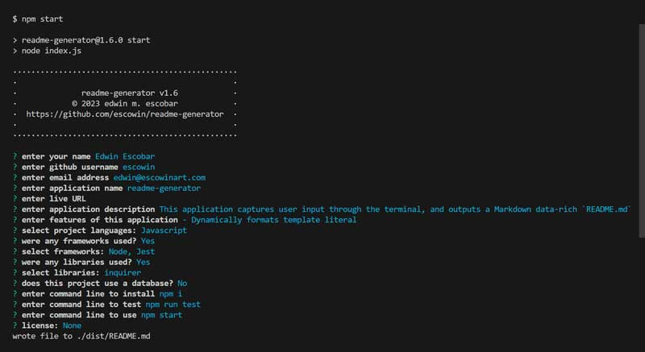
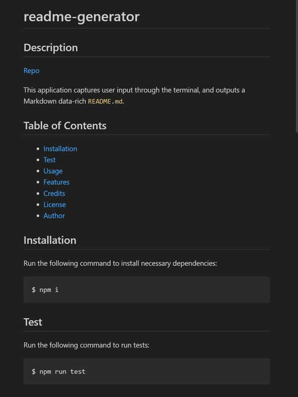

# readme-generator

## Description
[Repo](https://github.com/escowin/readme-generator) 

This application captures user input through the terminal, and generates a data-rich `README.md` in Markdown format. Template literal functions were improved & consolidated through Test-Driven Development principles. Furthermore, the incorporation of \n was crucial in removing any instances of undesirable whitespace from the generated output codebase.

## Table of Contents
- [Installation](#installation)
- [Test](#test)
- [Usage](#usage)
- [Features](#features)
- [Credits](#credits)
- [License](#license)
- [Author](#author)

## Installation
Run the following command to install necessary dependencies:
```
$ npm i
```

## Test
Run the following command to run tests:
```
$ npm run test
```

## Usage
Run the following command to run app:
```
$ npm start
```






## Features
- Dynamically formats template literal

## Credits
- Languages: Javascript
- Frameworks: Node, Jest
- Libraries: inquirer

## Author
### Edwin Escobar
- [Email](mailto:edwin@escowinart.com)
- [GitHub](https://github.com/escowin)
