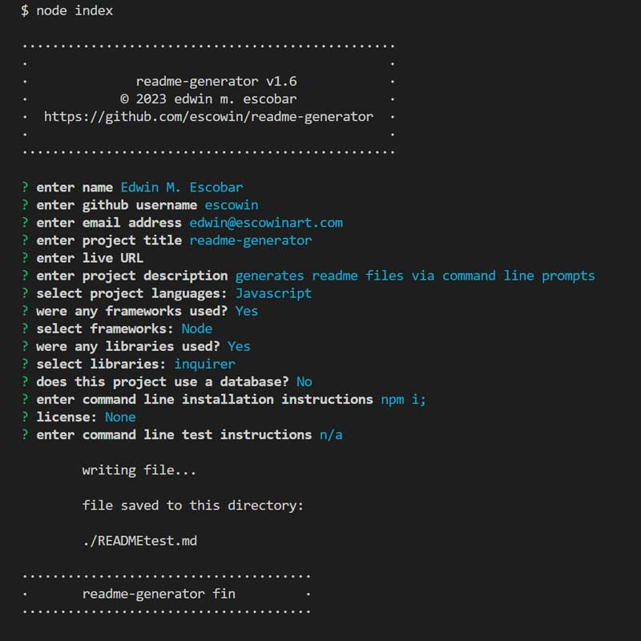

# readme-generator

## Description
[Repo](https://github.com/escowin/readme-generator)

generates readme files via command line prompts

## Table of Contents
- [Installation](#installation)
- [Code](#code)
- [Test](#test)
- [Screenshots](#screenshots)
- [Author](#author)

## Installation
Run the following command to install necessary dependencies:
```
$ npm i
```

## Code
- Languages: Javascript
- Frameworks: Node
- Libraries: inquirer

## Test
Run the following command to run tests:
```
n/a
```

## Screenshots


## Author
###  Edwin M. Escobar
- [GitHub](https://github.com/escowin)
- [Email](mailto:edwin@escowinart.com)
